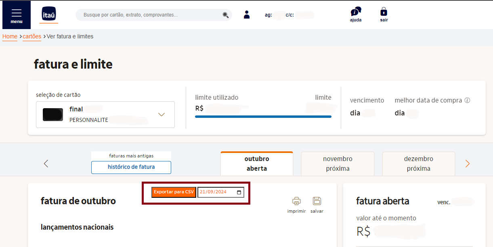

# Itau-csv

**Itau-csv** é uma extensão para o Google Chrome que adiciona um botão para exportação da fatura em aberto do Itaú no formato CSV.

O Itaú atualmente permite que a fatura seja baixada apenas em PDF ou Excel, que já vêm formatados, o que pode dificultar a importação em aplicativos de controle financeiro. Com essa extensão, você poderá gerar um arquivo CSV no formato mais adequado para esse tipo de importação.

O modelo de CSV é baseado no formato utilizado pelo aplicativo [Meu Dinheiro](http://www.meudinheiroweb.com.br).

## Pré-requisitos

- Instalar a [extensão de segurança do Itaú](https://www.itau.com.br) para habilitar a visualização da fatura no bankline.

## Como Instalar

1. Baixe o código desta extensão.
2. No Google Chrome, vá até `chrome://extensions/`.
3. Ative o modo desenvolvedor (no canto superior direito).
4. Clique em "Carregar sem compactação" e selecione a pasta onde você baixou o código.

Agora, a extensão estará disponível para uso e você poderá exportar suas faturas em CSV.

## Botão e Filtro de data adicionados
