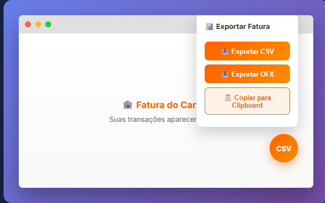
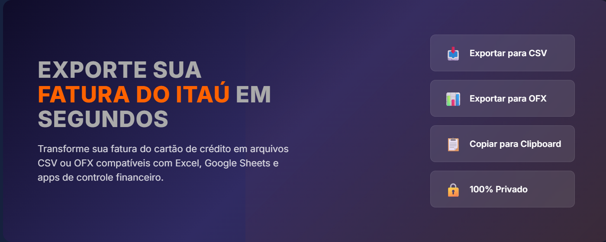

# Itaú Exportar Fatura CSV/OFX

<p align="center">
  
</p>

<p align="center">
  <strong>Exporte sua fatura do cartão Itaú para CSV ou OFX</strong><br>
  Compatível com Excel, Google Sheets e apps de controle financeiro
</p>

<p align="center">
  <a href="https://chromewebstore.google.com/detail/emfohciinphonpoklgkfndhpfbpikhll?utm_source=item-share-cb">
    
  </a>
</p>

---

### Botão Flutuante e Painel de Exportação

<p align="center">
  
</p>

### Opções de Exportação

<p align="center">
  
</p>

---

## ✨ Funcionalidades

| Recurso | Descrição |
|---------|-----------|
| 📥 **Exportar CSV** | Formato compatível com Excel, Google Sheets, LibreOffice |
| 📊 **Exportar OFX** | Compatível com apps financeiros (Mobills, Organizze, YNAB) |
| 📋 **Copiar Clipboard** | Cole diretamente em planilhas |
| 📅 **Filtro por Data** | Exporte apenas transações a partir de uma data |
| 🔄 **Detecção Automática** | Identifica créditos e débitos automaticamente |
| 🔒 **100% Privado** | Nenhum dado é enviado para servidores externos |

---

## 🚀 Como Usar

1. **Instale a extensão** via Chrome Web Store ou manualmente
2. **Acesse o Internet Banking** do Itaú
3. **Navegue até a fatura** do seu cartão de crédito
4. **Clique no botão laranja "CSV"** no canto inferior direito
5. **Escolha o formato** de exportação desejado

---

## 💻 Instalação Manual (Desenvolvedor)

### Pré-requisitos
- Google Chrome ou navegador baseado em Chromium
- Extensão de segurança do Itaú instalada

### Passos

1. Clone ou baixe este repositório:
   ```bash
   git clone https://github.com/QuelitonSouza/gerar-csv-fatura-cartao-itau.git
   ```

2. Abra o Chrome e acesse `chrome://extensions/`

3. Ative o **Modo desenvolvedor** (canto superior direito)

4. Clique em **"Carregar sem compactação"**

5. Selecione a pasta do projeto

---

## 📁 Estrutura do Projeto

```
📦 gerar-csv-fatura-cartao-itau
├── 📄 manifest.json          # Configuração da extensão
├── 📄 extrato-itau.js        # Código principal
├── 🖼️ itau-128.png           # Ícone 128x128
├── 🖼️ itau-48.png            # Ícone 48x48
├── 🖼️ itau-16.png            # Ícone 16x16
├── 📄 CHANGELOG.md           # Histórico de versões
├── 📄 politica-de-privacidade.md
└── 📄 README.md
```

---

## 🔒 Privacidade

Esta extensão:
- ✅ Funciona 100% offline no seu navegador
- ✅ Não coleta dados pessoais
- ✅ Não envia informações para servidores externos
- ✅ Não armazena senhas ou credenciais

[Leia a Política de Privacidade completa](politica-de-privacidade.md)

---

## 📝 Changelog

Veja o [CHANGELOG.md](CHANGELOG.md) para o histórico completo de versões.

### Versão 3.0.7 (Atual)
- 🔧 Detecção aprimorada da página de fatura
- 🔧 Suporte melhorado para navegação SPA
- 🐛 Correção de timeout em páginas lentas

---

## 🤝 Contribuindo

Encontrou um bug ou tem uma sugestão?

- 🐛 [Abrir uma Issue](https://github.com/QuelitonSouza/gerar-csv-fatura-cartao-itau/issues)
- 💬 [LinkedIn](https://www.linkedin.com/in/qspires/)

---

## 📄 Licença

Este projeto está sob a licença MIT. Veja o arquivo [LICENSE](LICENSE) para mais detalhes.

---

<p align="center">
  Desenvolvido com ❤️ para facilitar o controle financeiro pessoal
</p>
